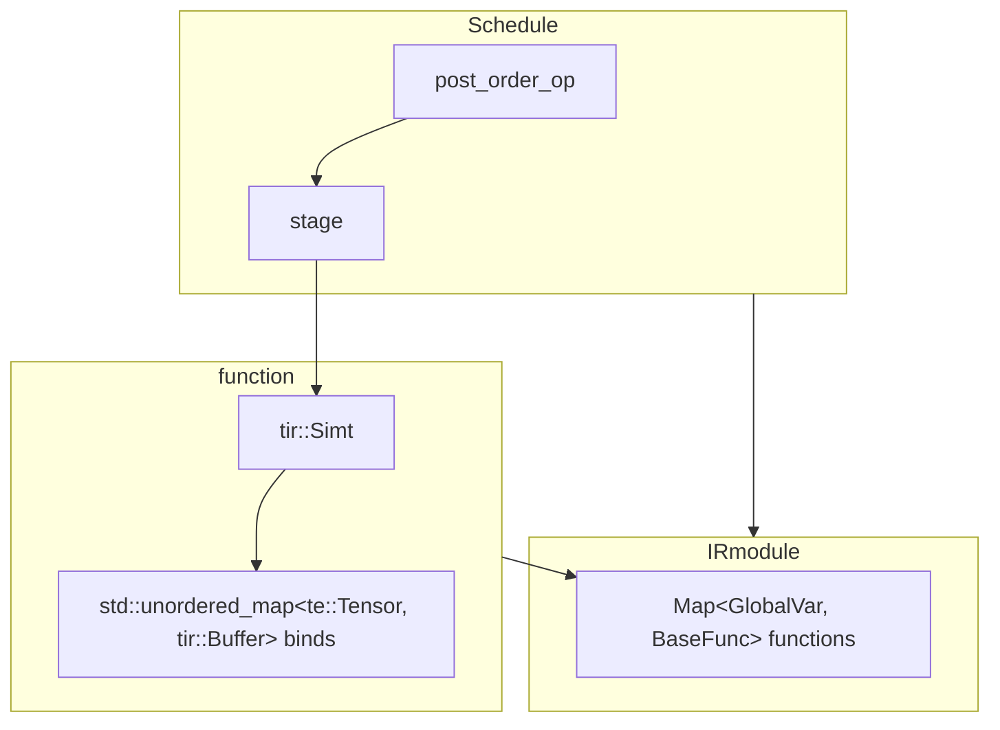
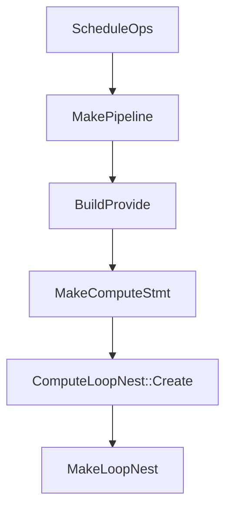

# AI编译器TVM code explain
[TOC]
# 总览

以实现TVM向量加法为例



## run_code

```cpp
  int n = 1024;

  // 定义输入张量 A
  Tensor A = placeholder({n}, DataType::Float(32), "A");

  // 定义 reduce 轴 k
  auto k = reduce_axis(Range(0, n), "k");

  // 计算 B，使用 sum 进行归约
  Tensor B = compute(
      {1},
      [&](Var i) {
        return sum(A(k), {k});
      },
      "B");

  // 创建 schedule
  Schedule s = create_schedule({B->op});
  Map<te::Tensor, tir::Buffer> binds;

  auto _ir = lower_s(s, {A, B}, "main", binds, false);
  auto _print_ir = [](IRModule mod, String header, bool show_metadata) -> bool {
    for (const auto& it : mod->functions) {
//      if (it.second->IsInstance<tvm::relay::FunctionNode>()) {
        LOG(INFO) << "PrintIR(" << header << "):\n" << tvm::relay::AsText(mod, show_metadata);
//        return true;
//      }
    }
    return false;
    };
  auto f = _print_ir(_ir,"main", true);
  std::cout << f << std::endl;
```

# 前置知识

- 单位元

在数学和计算机科学中，**单位元（Identity Element）** 是指在某个运算中，**不会改变其他元素值的特殊元素**。

- **加法单位元是 `0`**，因为对任何 `x`：
x+0=0+x=x
    
    x+0=0+x=xx + 0 = 0 + x = x
    
- **乘法单位元是 `1`**，因为对任何 `x`：
x×1=1×x=x
    
    x×1=1×x=xx \times 1 = 1 \times x = x
    
- **最大值的单位元是 `∞`**，因为：
max(x,−∞)=x
    
    max⁡(x,−∞)=x\max(x, -∞) = x
    
- **最小值的单位元是 `+∞`**，因为：
min(x,+∞)=x
    
    min⁡(x,+∞)=x\min(x, +∞) = x
    
- C++
- deeplearning

# Python—C++ 交互接口

- C++ 注册函数

```cpp
Registry& Registry::Register(const String& name, bool can_override) {  // NOLINT(*)
  Manager* m = Manager::Global();
  std::lock_guard<std::mutex> lock(m->mutex);
  if (m->fmap.count(name)) {
    ICHECK(can_override) << "Global PackedFunc " << name << " is already registered";
  }

  Registry* r = new Registry();
  r->name_ = name;
  m->fmap[name] = r;
  return *r;
}
```

## python 2 tvm

 

```python

def register_func(func_name, f=None, override=False):
    """Register global function

    Parameters
    ----------
    func_name : str or function
        The function name

    f : function, optional
        The function to be registered.

    override: boolean optional
        Whether override existing entry.

    Returns
    -------
    fregister : function
        Register function if f is not specified.

    Examples
    --------
    The following code registers my_packed_func as global function.
    Note that we simply get it back from global function table to invoke
    it from python side. However, we can also invoke the same function
    from C++ backend, or in the compiled TVM code.

    .. code-block:: python

      targs = (10, 10.0, "hello")
      @tvm.register_func
      def my_packed_func(*args):
          assert(tuple(args) == targs)
          return 10
      # Get it out from global function table
      f = tvm.get_global_func("my_packed_func")
      assert isinstance(f, tvm.PackedFunc)
      y = f(*targs)
      assert y == 10
    """
    if callable(func_name):
        f = func_name
        func_name = f.__name__

    if not isinstance(func_name, str):
        raise ValueError("expect string function name")

    ioverride = ctypes.c_int(override)

    def register(myf):
        """internal register function"""
        if not isinstance(myf, PackedFuncBase):
            myf = convert_to_tvm_func(myf)
        check_call(_LIB.TVMFuncRegisterGlobal(c_str(func_name), myf.handle, ioverride))
        return myf

    if f:
        return register(f)
    return register
def convert_to_tvm_func(pyfunc):
    """Convert a python function to TVM function

    Parameters
    ----------
    pyfunc : python function
        The python function to be converted.

    Returns
    -------
    tvmfunc: tvm.nd.Function
        The converted tvm function.
    """
    local_pyfunc = pyfunc

    def cfun(args, type_codes, num_args, ret, _):
        """ctypes function"""
        num_args = num_args.value if isinstance(num_args, ctypes.c_int) else num_args
        pyargs = (C_TO_PY_ARG_SWITCH[type_codes[i]](args[i]) for i in range(num_args))
        # pylint: disable=broad-except
        try:
            rv = local_pyfunc(*pyargs)
        except Exception as err:
            msg = traceback.format_exc()
            msg = py2cerror(msg)
            _LIB.TVMAPISetLastPythonError(ctypes.py_object(err))

            return -1

        if rv is not None:
            if isinstance(rv, tuple):
                raise ValueError("PackedFunction can only support one return value")
            temp_args = []
            values, tcodes, _ = _make_tvm_args((rv,), temp_args)
            if not isinstance(ret, TVMRetValueHandle):
                ret = TVMRetValueHandle(ret)
            if _LIB.TVMCFuncSetReturn(ret, values, tcodes, ctypes.c_int(1)) != 0:
                raise_last_ffi_error()
            _ = temp_args
            _ = rv
        return 0

    handle = PackedFuncHandle()
    f = TVMPackedCFunc(cfun)
    # NOTE: We will need to use python-api to increase ref count of the f
    # TVM_FREE_PYOBJ will be called after it is no longer needed.
    pyobj = ctypes.py_object(f)
    ctypes.pythonapi.Py_IncRef(pyobj)
    if _LIB.TVMFuncCreateFromCFunc(f, pyobj, TVM_FREE_PYOBJ, ctypes.byref(handle)) != 0:
        raise_last_ffi_error()
    return _make_packed_func(handle, False)
```

```cpp
int TVMFuncRegisterGlobal(const char* name, TVMFunctionHandle f, int override) {
  API_BEGIN();
  using tvm::runtime::GetRef;
  using tvm::runtime::PackedFunc;
  using tvm::runtime::PackedFuncObj;
  tvm::runtime::Registry::Register(name, override != 0)
      .set_body(GetRef<PackedFunc>(static_cast<PackedFuncObj*>(f)));
  API_END();
}
```

- python

[setup.py](http://setup.py) 

- tutorial

https://www.bilibili.com/video/BV1Mu411w7Nw

## cython

# TVM

## TypeContext

通过 TypeContext单例 注册全局类型 

```cpp
class TypeContext {
 public:
  // NOTE: this is a relatively slow path for child checking
  // Most types are already checked by the fast-path via reserved slot checking.
  bool DerivedFrom(uint32_t child_tindex, uint32_t parent_tindex) {
    // invariance: child's type index is always bigger than its parent.
    if (child_tindex < parent_tindex) return false;
    if (child_tindex == parent_tindex) return true;
    {
      std::lock_guard<std::mutex> lock(mutex_);
      ICHECK_LT(child_tindex, type_table_.size());
      while (child_tindex > parent_tindex) {
        child_tindex = type_table_[child_tindex].parent_index;
      }
    }
    return child_tindex == parent_tindex;
  }

  uint32_t GetOrAllocRuntimeTypeIndex(const std::string& skey, uint32_t static_tindex,
                                      uint32_t parent_tindex, uint32_t num_child_slots,
                                      bool child_slots_can_overflow) {
    std::lock_guard<std::mutex> lock(mutex_);
    auto it = type_key2index_.find(skey);
    if (it != type_key2index_.end()) {
      return it->second;
    }
    // try to allocate from parent's type table.
    ICHECK_LT(parent_tindex, type_table_.size())
        << " skey=" << skey << ", static_index=" << static_tindex;
    TypeInfo& pinfo = type_table_[parent_tindex];
    ICHECK_EQ(pinfo.index, parent_tindex);

    // if parent cannot overflow, then this class cannot.
    if (!pinfo.child_slots_can_overflow) {
      child_slots_can_overflow = false;
    }

    // total number of slots include the type itself.
    uint32_t num_slots = num_child_slots + 1;
    uint32_t allocated_tindex;

    if (static_tindex != TypeIndex::kDynamic) {
      // statically assigned type
      VLOG(3) << "TypeIndex[" << static_tindex << "]: static: " << skey << ", parent "
              << type_table_[parent_tindex].name;
      allocated_tindex = static_tindex;
      ICHECK_LT(static_tindex, type_table_.size());
      ICHECK_EQ(type_table_[allocated_tindex].allocated_slots, 0U)
          << "Conflicting static index " << static_tindex << " between "
          << type_table_[allocated_tindex].name << " and " << skey;
    } else if (pinfo.allocated_slots + num_slots <= pinfo.num_slots) {
      // allocate the slot from parent's reserved pool
      allocated_tindex = parent_tindex + pinfo.allocated_slots;
      VLOG(3) << "TypeIndex[" << allocated_tindex << "]: dynamic: " << skey << ", parent "
              << type_table_[parent_tindex].name;
      // update parent's state
      pinfo.allocated_slots += num_slots;
    } else {
      VLOG(3) << "TypeIndex[" << type_counter_ << "]: dynamic (overflow): " << skey << ", parent "
              << type_table_[parent_tindex].name;
      ICHECK(pinfo.child_slots_can_overflow)
          << "Reach maximum number of sub-classes for " << pinfo.name;
      // allocate new entries.
      allocated_tindex = type_counter_;
      type_counter_ += num_slots;
      ICHECK_LE(type_table_.size(), type_counter_);
      type_table_.resize(type_counter_, TypeInfo());
    }
    ICHECK_GT(allocated_tindex, parent_tindex);
    // initialize the slot.
    type_table_[allocated_tindex].index = allocated_tindex;
    type_table_[allocated_tindex].parent_index = parent_tindex;
    type_table_[allocated_tindex].num_slots = num_slots;
    type_table_[allocated_tindex].allocated_slots = 1;
    type_table_[allocated_tindex].child_slots_can_overflow = child_slots_can_overflow;
    type_table_[allocated_tindex].name = skey;
    type_table_[allocated_tindex].name_hash = std::hash<std::string>()(skey);
    // update the key2index mapping.
    type_key2index_[skey] = allocated_tindex;
    return allocated_tindex;
  }

  std::string TypeIndex2Key(uint32_t tindex) {
    std::lock_guard<std::mutex> lock(mutex_);
    if (tindex != 0) {
      // always return the right type key for root
      // for non-root type nodes, allocated slots should not equal 0
      ICHECK(tindex < type_table_.size() && type_table_[tindex].allocated_slots != 0)
          << "Unknown type index " << tindex;
    }
    return type_table_[tindex].name;
  }

  size_t TypeIndex2KeyHash(uint32_t tindex) {
    std::lock_guard<std::mutex> lock(mutex_);
    ICHECK(tindex < type_table_.size() && type_table_[tindex].allocated_slots != 0)
        << "Unknown type index " << tindex;
    return type_table_[tindex].name_hash;
  }

  uint32_t TypeKey2Index(const std::string& skey) {
    auto it = type_key2index_.find(skey);
    ICHECK(it != type_key2index_.end())
        << "Cannot find type " << skey
        << ". Did you forget to register the node by TVM_REGISTER_NODE_TYPE ?";
    return it->second;
  }

  void Dump(int min_children_count) {
    std::vector<int> num_children(type_table_.size(), 0);
    // reverse accumulation so we can get total counts in a bottom-up manner.
    for (auto it = type_table_.rbegin(); it != type_table_.rend(); ++it) {
      if (it->index != 0) {
        num_children[it->parent_index] += num_children[it->index] + 1;
      }
    }

    for (const auto& info : type_table_) {
      if (info.index != 0 && num_children[info.index] >= min_children_count) {
        std::cerr << '[' << info.index << "] " << info.name
                  << "\tparent=" << type_table_[info.parent_index].name
                  << "\tnum_child_slots=" << info.num_slots - 1
                  << "\tnum_children=" << num_children[info.index] << std::endl;
      }
    }
  }

  static TypeContext* Global() {
    static TypeContext inst;
    return &inst;
  }

 private:
  TypeContext() {
    type_table_.resize(TypeIndex::kStaticIndexEnd, TypeInfo());
    type_table_[0].name = "runtime.Object";
  }
  // mutex to avoid registration from multiple threads.
  std::mutex mutex_;
  std::atomic<uint32_t> type_counter_{TypeIndex::kStaticIndexEnd};
  std::vector<TypeInfo> type_table_;
  std::unordered_map<std::string, uint32_t> type_key2index_;
};
```

## 全局函数

```cpp
TVM_REGISTER_NODE_TYPE(ConstIntBoundNode);
#define TVM_REGISTER_NODE_TYPE(TypeName)                                             \
  TVM_REGISTER_OBJECT_TYPE(TypeName);                                                \
  TVM_REGISTER_REFLECTION_VTABLE(TypeName, ::tvm::detail::ReflectionTrait<TypeName>) \
      .set_creator([](const std::string&) -> ObjectPtr<Object> {                     \
        return ::tvm::runtime::make_object<TypeName>();                              \
      })
#define TVM_REGISTER_OBJECT_TYPE(TypeName) \
  TVM_STR_CONCAT(TVM_OBJECT_REG_VAR_DEF, __COUNTER__) = TypeName::_GetOrAllocRuntimeTypeIndex()
#define TVM_OBJECT_REG_VAR_DEF static TVM_ATTRIBUTE_UNUSED uint32_t __make_Object_tid
#define TVM_ATTRIBUTE_UNUSED __attribute__((unused))

#define TVM_STR_CONCAT(__x, __y) TVM_STR_CONCAT_(__x, __y)
#define TVM_STR_CONCAT_(__x, __y) __x##__y
#define TVM_REGISTER_REFLECTION_VTABLE(TypeName, TraitName) \
  TVM_STR_CONCAT(TVM_REFLECTION_REG_VAR_DEF, __COUNTER__) = \
      ::tvm::ReflectionVTable::Global()->Register<TypeName, TraitName>()
template <typename T, typename TraitName>
inline ReflectionVTable::Registry ReflectionVTable::Register() {
  uint32_t tindex = T::RuntimeTypeIndex();
  if (tindex >= fvisit_attrs_.size()) {
    fvisit_attrs_.resize(tindex + 1, nullptr);
    fcreate_.resize(tindex + 1, nullptr);
    frepr_bytes_.resize(tindex + 1, nullptr);
    fsequal_reduce_.resize(tindex + 1, nullptr);
    fshash_reduce_.resize(tindex + 1, nullptr);
  }
  // functor that implements the redirection.
  fvisit_attrs_[tindex] = ::tvm::detail::SelectVisitAttrs<T, TraitName>::VisitAttrs;

  fsequal_reduce_[tindex] = ::tvm::detail::SelectSEqualReduce<T, TraitName>::SEqualReduce;

  fshash_reduce_[tindex] = ::tvm::detail::SelectSHashReduce<T, TraitName>::SHashReduce;

  return Registry(this, tindex);
}
//################################3
  TVM_DECLARE_FINAL_OBJECT_INFO(ConstIntBoundNode, Object);
#define TVM_DECLARE_FINAL_OBJECT_INFO(TypeName, ParentType) \
  static const constexpr bool _type_final = true;           \
  static const constexpr int _type_child_slots = 0;         \
  TVM_DECLARE_BASE_OBJECT_INFO(TypeName, ParentType)
  #define   TVM_DECLARE_BASE_OBJECT_INFO(TypeName, ParentType)                                     \
  static_assert(!ParentType::_type_final, "ParentObj marked as final");                        \
  static uint32_t RuntimeTypeIndex() {                                                         \
    static_assert(TypeName::_type_child_slots == 0 || ParentType::_type_child_slots == 0 ||    \
                      TypeName::_type_child_slots < ParentType::_type_child_slots,             \
                  "Need to set _type_child_slots when parent specifies it.");                  \
    if (TypeName::_type_index != ::tvm::runtime::TypeIndex::kDynamic) {                        \
      return TypeName::_type_index;                                                            \
    }                                                                                          \
    return _GetOrAllocRuntimeTypeIndex();                                                      \
  }                                                                                            \
  static uint32_t _GetOrAllocRuntimeTypeIndex() {                                              \
    static uint32_t tindex = Object::GetOrAllocRuntimeTypeIndex(                               \
        TypeName::_type_key, TypeName::_type_index, ParentType::_GetOrAllocRuntimeTypeIndex(), \
        TypeName::_type_child_slots, TypeName::_type_child_slots_can_overflow);                \
    return tindex;                                                                             \
  }
  uint32_t Object::GetOrAllocRuntimeTypeIndex(const std::string& key, uint32_t static_tindex,
                                            uint32_t parent_tindex, uint32_t num_child_slots,
                                            bool child_slots_can_overflow) {
  return TypeContext::Global()->GetOrAllocRuntimeTypeIndex(
      key, static_tindex, parent_tindex, num_child_slots, child_slots_can_overflow);
}
  uint32_t GetOrAllocRuntimeTypeIndex(const std::string& skey, uint32_t static_tindex,
                                      uint32_t parent_tindex, uint32_t num_child_slots,
                                      bool child_slots_can_overflow) {
    std::lock_guard<std::mutex> lock(mutex_);
    auto it = type_key2index_.find(skey);
    if (it != type_key2index_.end()) {
      return it->second;
    }
    // try to allocate from parent's type table.
    ICHECK_LT(parent_tindex, type_table_.size())
        << " skey=" << skey << ", static_index=" << static_tindex;
    TypeInfo& pinfo = type_table_[parent_tindex];
    ICHECK_EQ(pinfo.index, parent_tindex);

    // if parent cannot overflow, then this class cannot.
    if (!pinfo.child_slots_can_overflow) {
      child_slots_can_overflow = false;
    }

    // total number of slots include the type itself.
    uint32_t num_slots = num_child_slots + 1;
    uint32_t allocated_tindex;

    if (static_tindex != TypeIndex::kDynamic) {
      // statically assigned type
      VLOG(3) << "TypeIndex[" << static_tindex << "]: static: " << skey << ", parent "
              << type_table_[parent_tindex].name;
      allocated_tindex = static_tindex;
      ICHECK_LT(static_tindex, type_table_.size());
      ICHECK_EQ(type_table_[allocated_tindex].allocated_slots, 0U)
          << "Conflicting static index " << static_tindex << " between "
          << type_table_[allocated_tindex].name << " and " << skey;
    } else if (pinfo.allocated_slots + num_slots <= pinfo.num_slots) {
      // allocate the slot from parent's reserved pool
      allocated_tindex = parent_tindex + pinfo.allocated_slots;
      VLOG(3) << "TypeIndex[" << allocated_tindex << "]: dynamic: " << skey << ", parent "
              << type_table_[parent_tindex].name;
      // update parent's state
      pinfo.allocated_slots += num_slots;
    } else {
      VLOG(3) << "TypeIndex[" << type_counter_ << "]: dynamic (overflow): " << skey << ", parent "
              << type_table_[parent_tindex].name;
      ICHECK(pinfo.child_slots_can_overflow)
          << "Reach maximum number of sub-classes for " << pinfo.name;
      // allocate new entries.
      allocated_tindex = type_counter_;
      type_counter_ += num_slots;
      ICHECK_LE(type_table_.size(), type_counter_);
      type_table_.resize(type_counter_, TypeInfo());
    }
    ICHECK_GT(allocated_tindex, parent_tindex);
    // initialize the slot.
    type_table_[allocated_tindex].index = allocated_tindex;
    type_table_[allocated_tindex].parent_index = parent_tindex;
    type_table_[allocated_tindex].num_slots = num_slots;
    type_table_[allocated_tindex].allocated_slots = 1;
    type_table_[allocated_tindex].child_slots_can_overflow = child_slots_can_overflow;
    type_table_[allocated_tindex].name = skey;
    type_table_[allocated_tindex].name_hash = std::hash<std::string>()(skey);
    // update the key2index mapping.
    type_key2index_[skey] = allocated_tindex;
    return allocated_tindex;
  }
```

## 类型转换

### as

```cpp
template <typename ObjectType, typename>
inline const ObjectType* ObjectRef::as() const {
  if (data_ != nullptr && data_->IsInstance<ObjectType>()) {
    return static_cast<ObjectType*>(data_.get());
  } else {
    return nullptr;
  }
}
template <typename TargetType>
inline bool Object::IsInstance() const {
  const Object* self = this;
  // NOTE: the following code can be optimized by
  // compiler dead-code elimination for already known constants.
  if (self != nullptr) {
    // Everything is a subclass of object.
    if (std::is_same<TargetType, Object>::value) return true;
    if (TargetType::_type_final) {
      // if the target type is a final type
      // then we only need to check the equivalence.
      return self->type_index_ == TargetType::RuntimeTypeIndex();
    } else {
      // if target type is a non-leaf type
      // Check if type index falls into the range of reserved slots.
      uint32_t begin = TargetType::RuntimeTypeIndex();
      // The condition will be optimized by constant-folding.
      if (TargetType::_type_child_slots != 0) {
        uint32_t end = begin + TargetType::_type_child_slots;
        if (self->type_index_ >= begin && self->type_index_ < end) return true;
      } else {
        if (self->type_index_ == begin) return true;
      }
      if (!TargetType::_type_child_slots_can_overflow) return false;
      // Invariance: parent index is always smaller than the child.
      if (self->type_index_ < TargetType::RuntimeTypeIndex()) return false;
      // The rare slower-path, check type hierarchy.
      return self->DerivedFrom(TargetType::RuntimeTypeIndex());
    }
  } else {
    return false;
  }
}

```

# Tir

## **`tir::CommReducer`**

在 TVM（Tensor Virtual Machine）中，`tir::CommReducer` 是 **TIR（Tensor Intermediate Representation）** 层中的一个 **通用归约（Reduction）算子**，用于描述 **可交换和可结合（commutative and associative）的归约运算**，例如求和（sum）、最大值（max）、最小值（min）等。

```cpp
PrimExpr lhs = Var("lhs", DataType::Int(32));
PrimExpr rhs = Var("rhs", DataType::Int(32));
PrimExpr sum = lhs + rhs;  // 定义加法归约操作
PrimExpr identity = IntImm(DataType::Int(32), 0);  // 单位元 0

CommReducer add_reducer({lhs, rhs}, {sum}, {identity});
```

## tir::IterVar

`IterVar` 是 **TVM** 中的一个核心概念，它代表了 **计算过程中的迭代变量**，即在计算图中用来遍历数据（如矩阵、张量等）的一些变量。`IterVar` 通常用于定义和控制迭代维度，表示如何在并行或循环的过程中进行迭代。它广泛用于定义 **调度（schedule）** 和 **计算图（computation graph）** 中的访问模式。

- **`Range dom`**：表示该迭代变量的取值范围（或域）。
    - `Range` 是一个表示 **区间** 或 **范围** 的对象，它指定了该迭代变量的最小值和最大值。
    - 例如，`Range(0, 10)` 表示该变量的取值范围是从 0 到 10（包括 0，但不包括 10）。
- **`Var var`**：这是表示迭代变量的具体名称或变量。
    - `Var` 是 TVM 中的变量类，用于定义具体的计算中使用的变量。
    - 比如，`Var("i")` 表示迭代变量 `i`，它可以作为计算的索引。
- **`IterVarType t`**：表示该迭代变量的类型，定义了迭代变量的性质以及它在调度中的作用。
    - `IterVarType` 是一个枚举类型，它包含几种常见的类型，如：
        - `kData`：表示普通的数据迭代变量，通常用于访问张量中的元素。
        - `kReduction`：表示归约操作中的迭代变量，用于处理归约类型的计算（如求和、求最大值等）。
        - `kUnroll`：表示展开操作的迭代变量，用于实现循环展开。
        - `kParallel`：表示并行迭代变量，常用于并行化的计算。
        - `kOpaque`  :
        在 TVM 中，大部分 `IterVar` 都是 `kDataPar`（普通计算索引）或 `kCommReduce`（归约变量）。然而，在某些情况下，**TVM 可能需要一个“无特定调度语义”的变量**，这就是 `kOpaque` 存在的意义。
            
            它本质上是一个 **“占位符”变量**，用于存储某些计算索引，但不希望 TVM 进行调度优化。
            
- **`String thread_tag`**：表示该迭代变量与线程的绑定标签。
    - `thread_tag` 是一个字符串，它用于标识该迭代变量与具体线程的绑定关系。在 TVM 的调度中，某些迭代变量可以被分配到特定的线程或设备上，从而优化并行执行。例如，`"threadIdx.x"` 就可以表示线程在 x 维度上的索引。
- **`Span span`**：表示源代码中的位置范围。
    - `Span` 是一个表示 **源代码位置** 的类，它通常用于调试和错误报告。当 TVM 生成计算图时，如果遇到问题，`span` 会提供该问题的源代码位置，方便开发者进行调试。
    - 在构造迭代变量时，`span` 可以用来跟踪该变量在代码中的位置。

```cpp
IterVar::IterVar(Range dom, Var var, IterVarType t, String thread_tag, Span span) {
  ObjectPtr<IterVarNode> n = make_object<IterVarNode>();
  if (dom.defined() && dom->extent.defined()) {
    CHECK(dom->extent.dtype().is_int())
        << "The dtype of the domain of an IterVar must be an integer type. However, the domain's "
           "dtype is "
        << dom->extent.dtype();
    CHECK_EQ(dom->extent.dtype(), var.dtype())
        << "The dtype of the extent of an IterVar (" << dom->extent.dtype()
        << ") must match its associated Var's dtype (" << var.dtype() << ")";
  }
  n->dom = dom;
  n->var = var;
  n->iter_type = t;
  n->thread_tag = thread_tag;
  n->span = std::move(span);
  data_ = std::move(n);
}
```

## tir:funtion

### attr

```cpp
  Map<String, ObjectRef> dict;
```

### params

```cpp
  Array<tir::Var> params;
```

### Buffer

```cpp
  Map<tir::Var, Buffer> buffer_map;
```

- allocate
    - struct
    
    ```cpp
      std::unordered_map<Buffer, Doc, ObjectPtrHash, ObjectPtrEqual> memo_buf_;
    ```
    

```cpp
Doc TIRTextPrinter::AllocBuf(const Buffer& buffer) {
  const auto& it = memo_buf_.find(buffer);
  if (it != memo_buf_.end()) {
    return it->second;
  }
  std::string name = buffer->name;
  if (name.length() == 0 || !std::isalpha(name[0])) {
    name = "buf_" + name;
  }
  Doc val = GetUniqueName(name);
  memo_buf_[buffer] = val;
  return val;
}

```

### create

```cpp
tir::PrimFunc f = te::SchedulePostProcToPrimFunc(out_arg_list, std::move(stmt), out_binds);
PrimFunc SchedulePostProcToPrimFunc(Array<ObjectRef> arg_list, Stmt body,
                                    Optional<Map<Tensor, Buffer>> extern_buffer_opt) {
  std::unordered_map<Tensor, Buffer> extern_tensor_map;

  if (extern_buffer_opt.defined()) {
    auto v = extern_buffer_opt.value();
    extern_tensor_map = std::unordered_map<Tensor, Buffer>(v.begin(), v.end());
  }

  Array<tir::Var> params;
  Map<tir::Var, tir::Buffer> buffer_map;

  for (auto arg : arg_list) {
    if (auto* n = arg.as<tir::VarNode>()) {
      tir::Var var = GetRef<tir::Var>(n);
      params.push_back(GetRef<tir::Var>(n));
    } else if (auto* n = arg.as<te::TensorNode>()) {
      te::Tensor tensor = GetRef<te::Tensor>(n);
      ICHECK(!extern_tensor_map.count(tensor));

      tir::Buffer buffer = CreateBufferFor(tensor);
      tir::Var bptr(buffer->name, PrimType(DataType::Handle()));
      params.push_back(bptr);
      buffer_map.Set(bptr, buffer);
      extern_tensor_map[tensor] = buffer;
    } else if (auto* n = arg.as<tir::BufferNode>()) {
      tir::Buffer buffer = GetRef<tir::Buffer>(n);
      tir::Var bptr(buffer->name, PrimType(DataType::Handle()));
      params.push_back(bptr);
      buffer_map.Set(bptr, buffer);
    } else {
      LOG(FATAL) << "Expected argument to be Var, Tensor, or Buffer, but received "
                 << arg->GetTypeKey();
    }
  }

  body = TensorToBufferMapper(std::move(extern_tensor_map))(std::move(body));

  PrimFunc func = tir::PrimFunc(params, body, VoidType(), buffer_map);

  func = LayoutTransformAttrUnwrapper::Apply(std::move(func));
  func = AxisSeparatorsAttrUnwrapper::Apply(std::move(func));

  // We mark this PrimFunc as coming from a TE schedule
  func = WithAttr(func, "from_legacy_te_schedule", Bool(true));

  return func;
}
```

### print

 

```cpp
Doc RelayTextPrinter::PrintFunc(const Doc& prefix, const relay::Function& fn) {
  Doc doc;
  doc << prefix;
  if (fn->type_params.size() > 0) {
    doc << "[";
    std::vector<Doc> type_params;
    for (const TypeVar& tv : fn->type_params) {
      type_params.push_back(Doc::Text(tv->name_hint));
    }
    doc << Doc::Concat(type_params);
    doc << "]";
  }
  doc << "(";
  std::vector<Doc> params;
  for (Var param : fn->params) {
    params.push_back(AllocVar(param));
  }
  for (const Doc& d : PrintDictAttrs(fn->attrs)) {
    params.push_back(d);
  }
  if (!fn->virtual_device()->IsFullyUnconstrained()) {
    Doc vid_doc;
    vid_doc << kVirtualDevice << "=" << PrintAttributeValue(fn->virtual_device());
    params.push_back(vid_doc);
  }
  doc << Doc::Concat(params) << ") ";
  if (fn->ret_type.defined()) {
    doc << "-> " << Print(fn->ret_type) << " ";
  }
  doc << PrintBody(fn->body);
  return doc;
}
```

## tir::Buffer

### create

```cpp
tir::Buffer BufferWithOffsetAlignment(Array<PrimExpr> shape, DataType dtype, std::string name,
                                      int data_alignment, int offset_factor, bool compact,
                                      std::string memory_scope) {
  DataType storage_dtype = (dtype == DataType::Bool() ? DataType::Int(8) : dtype);
  auto data = tir::Var(name, PointerType(PrimType(storage_dtype), memory_scope));
  bool has_any = false;
  if (!compact) {
    for (const auto& it : shape) {
      if (it.as<tir::VarNode>()) {
        has_any = true;
        break;
      }
    }
  }
  tir::BufferType buffer_type = has_any ? tir::kAutoBroadcast : tir::kDefault;

  PrimExpr elem_offset;
  if (offset_factor != 0) {
    elem_offset = tir::Var(name + "_elem_offset", shape[0].dtype());
  } else {
    elem_offset = PrimExpr();
  }

  return tir::Buffer(data, dtype, shape, Array<PrimExpr>(), elem_offset, name, data_alignment,
                     offset_factor, buffer_type);
}
Buffer::Buffer(Var data, DataType dtype, Array<PrimExpr> shape, Array<PrimExpr> strides,
               PrimExpr elem_offset, String name, int data_alignment, int offset_factor,
               BufferType buffer_type, Array<IntImm> axis_separators, Span span) {
  DataType storage_dtype = dtype;
  // specially handle bool
  if (storage_dtype == DataType::Bool()) {
    storage_dtype = DataType::Int(8);
  }
  // The buffer dtype may differ from the dtype of the underlying
  // allocation, such as a single allocation that backs multiple
  // tensors without a common datatype.  Therefore, we check that the
  // data pointer is a pointer, but not the exact type of the
  // pointed-to values.

  // TODO(Lunderberg): Use an explicit pointer cast for the data
  // pointer.  Should be done alongside extensions to StmtExprMutator
  // to more easily handle buffer/buffer_var updates.
  ICHECK(data->type_annotation.defined())
      << "Variable " << data->name_hint << " is missing a type annotation.";
  ICHECK(data->type_annotation.as<PointerTypeNode>())
      << "Variable " << data->name_hint << " is not a pointer.";
  ICHECK(data->type_annotation.as<PointerTypeNode>()->element_type.as<PrimTypeNode>())
      << "Variable " << data->name_hint << " does not point to a primitive.";

  ValidateAxisSeparators(axis_separators, shape.size());

  auto n = make_object<BufferNode>();
  n->data = std::move(data);
  n->dtype = dtype;

  n->shape = std::move(shape);
  n->strides = std::move(strides);
  n->axis_separators = std::move(axis_separators);
  n->name = std::move(name);
  if (!elem_offset.defined()) {
    elem_offset = make_const(n->DefaultIndexType(), 0);
  }
  if (data_alignment <= 0) {
    data_alignment = runtime::kAllocAlignment;
  }
  if (offset_factor == 0) {
    offset_factor = 1;
  }
  n->elem_offset = std::move(elem_offset);
  n->data_alignment = data_alignment;
  n->offset_factor = offset_factor;
  n->buffer_type = buffer_type;
  if (n->buffer_type == kAutoBroadcast && n->shape.size() > 0 && n->strides.empty()) {
    for (size_t i = 0; i < n->shape.size(); ++i) {
      n->strides.push_back(Var("stride", n->shape[i].dtype()));
    }
  }
  n->span = std::move(span);
  data_ = std::move(n);
}
```

## tir::simt

### call_chain



### create

path : src/te/schedule/schedule_ops.cc

```cpp
 tir::Stmt stmt = te::ScheduleOps(sch, te::InferBound(sch), debug_keep_trivial_loop);
Stmt ScheduleOps(Schedule sch, Map<IterVar, Range> dom_map_, bool debug_keep_trivial_loop) {
  Stmt body = Stmt();
  std::unordered_map<IterVar, Range> dom_map = as_unordered_map(dom_map_);
  // scan init and scan updates
  std::unordered_map<Operation, Operation> scan_init;
  for (Stage s : sch->stages) {
    const ScanOpNode* scan = s->op.as<ScanOpNode>();
    if (!scan) continue;
    for (Tensor t : scan->init) {
      if (scan_init.count(t->op)) {
        ICHECK(scan_init.at(t->op).same_as(s->op))
            << "Scan init tensor can only belong to one scan";
      } else {
        scan_init[t->op] = s->op;
      }
    }
  }
  // verify correctness of group.
  for (Stage g : sch->groups) {
    ICHECK(!g->op.defined());
    ICHECK_EQ(g->leaf_iter_vars.size(), 0U);
  }
  // reverse the post DFS order.
  for (size_t i = sch->stages.size(); i != 0; --i) {
    Stage s = sch->stages[i - 1];
    ICHECK_NE(s->attach_type, kInline) << "call schedule.normalize before scheduleops";
    ICHECK(s->op.defined());
    // Remove grouping sugar, get the real attach spec.
    Stage attach_spec = s.GetAttachSpec();

    if (s->op.as<PlaceholderOpNode>()) {
      // Placeholders don't need any realize/provide statements, but
      // may be annotated with set_physical_layout to indicate the
      // physical layout of an input, and must still have the
      // attribute given.
      body = WrapLayoutTransformationAttrs(s, std::move(body));
    } else if (scan_init.count(s->op)) {
      ICHECK(body.defined());
      InjectScanStep mu(s, scan_init.at(s->op), dom_map, true, debug_keep_trivial_loop);
      body = mu(std::move(body));
      ICHECK(mu.found_attach) << "did not find attachment point for scan.init";
    } else if (attach_spec->attach_type == kScanUpdate) {
      // Handle scan update
      ICHECK(body.defined());
      InjectScanStep mu(s, attach_spec->attach_stage->op, dom_map, false, debug_keep_trivial_loop);
      body = mu(std::move(body));
      ICHECK(mu.found_attach) << "did not find attachment point for scan.update";
    } else if (attach_spec->attach_type == kInlinedAlready) {
      // do nothing
    } else if (attach_spec->attach_type == kGroupRoot) {
      ICHECK(!s->group.defined());
      body = MakePipeline(s, dom_map, body, debug_keep_trivial_loop);
    } else {
      ICHECK_EQ(attach_spec->attach_type, kScope);
      ICHECK(body.defined());
      InjectAttach mutator(s, attach_spec, dom_map, debug_keep_trivial_loop);
      body = mutator(std::move(body));
      ICHECK(mutator.found_attach)
          << "did not find attachment point for " << s << " in " << attach_spec->attach_stage->op
          << " x " << attach_spec->attach_ivar << ", body:\n"
          << body;
    }
  }

  SchedulePostProc post_proc;
  post_proc.Init(sch);
  return post_proc(std::move(body));
}
Stmt MakePipeline(const Stage& s, const std::unordered_map<IterVar, Range>& dom_map, Stmt consumer,
                  bool debug_keep_trivial_loop) {
                  //构建提供输出的语句
  Stmt producer = s->op->BuildProvide(s, dom_map, debug_keep_trivial_loop);
  if (s->double_buffer) {
    producer = AttrStmt(s->op, tir::attr::double_buffer_scope, 1, producer);
  }
  producer = WrapLayoutTransformationAttrs(s, producer);
  Stmt pipeline = producer;

  if (consumer.defined() && !is_no_op(consumer)) {
    pipeline = SeqStmt({producer, consumer});
  }

  if (s->rolling_buffer) {
    pipeline = AttrStmt(s->op, tir::attr::rolling_buffer_scope, Bool(true), pipeline);
  }

  return s->op->BuildRealize(s, dom_map, pipeline, s->scope);
}
// implement the provide utility.
Stmt ComputeOpNode::BuildProvide(const Stage& stage,
                                 const std::unordered_map<IterVar, Range>& dom_map,
                                 bool debug_keep_trivial_loop) const {
  ICHECK_EQ(stage->op.operator->(), this);
  ComputeType ctype = DetectComputeType(this, stage);
  if (ctype == ComputeType::kCrossThreadReduction) {
    // specially handle cross thread reduction.
    return MakeCrossThreadReduction(this, stage, dom_map, debug_keep_trivial_loop);
  } else if (ctype == ComputeType::kTensorize) {
    return MakeTensorize(this, stage, dom_map, debug_keep_trivial_loop);
  } else {
    return MakeComputeStmt(this, stage, dom_map, debug_keep_trivial_loop);
  }
}
Stmt MakeComputeStmt(const ComputeOpNode* self, const Stage& stage,
                     const std::unordered_map<IterVar, Range>& dom_map,
                     bool debug_keep_trivial_loop) {
  // grab the nest structure
  ComputeLoopNest n = ComputeLoopNest::Create(self, stage, dom_map, debug_keep_trivial_loop);
  // Normal loop structure
  n.init_nest.emplace_back(MakeIfNest(n.init_predicates));
  n.main_nest.emplace_back(MakeIfNest(n.main_predicates));
  if (self->reduce_axis.size() != 0) {
    // make reduction.
    Stmt init, provide;
    Array<Tensor> source;
    for (size_t i = 0; i < self->body.size(); ++i) {
      source.push_back(stage->op.output(i));
    }
    MakeReduction(self, source, &init, &provide);
    init = MergeNest(n.init_nest, init);
    init = Substitute(init, n.init_vmap);
    // common nest
    std::vector<std::vector<Stmt>> common(n.main_nest.begin(),
                                          n.main_nest.begin() + n.num_common_loop + 1);
    std::vector<std::vector<Stmt>> reduce(n.main_nest.begin() + n.num_common_loop + 1,
                                          n.main_nest.end());
    provide = MergeNest(reduce, provide);
    if (debug_keep_trivial_loop) {
      provide = MergeNest(common, provide);
    } else {
      provide = MergeNest(common, SeqStmt::Flatten(init, provide));
    }
    // run substitution in the on the full nest, because  loop condition
    // could depend on outer loops.
    return Substitute(provide, n.main_vmap);
  } else {
    std::vector<Stmt> provides;
    for (size_t i = 0; i < self->body.size(); ++i) {
      provides.emplace_back(MakeProvide(self, stage->op.output(i)));
    }
    Stmt provide = SeqStmt::Flatten(provides);
    provide = MergeNest(n.main_nest, provide);
    // run substitution in the on the full nest, because  loop condition
    // could depend on outer loops.
    return Substitute(provide, n.main_vmap);
  }
}
ComputeLoopNest ComputeLoopNest::Create(const BaseComputeOpNode* self, const Stage& stage,
                                        const std::unordered_map<IterVar, Range>& dom_map,
                                        bool debug_keep_trivial_loop) {
  ICHECK_EQ(stage->op.operator->(), self);
  ComputeLoopNest ret;
  // make main loop nest
  ret.main_nest = MakeLoopNest(stage, dom_map, 0, false, std::unordered_set<IterVar>(),
                               &ret.main_vmap, debug_keep_trivial_loop);
  ret.main_predicates =
      MakeBoundCheck(stage, dom_map, ret.main_vmap, false, std::unordered_set<IterVar>());
  for (auto& e : ret.main_predicates) {
    e = likely(e);
  }
  if (stage->store_predicate.defined()) {
    ret.main_predicates.push_back(stage->store_predicate);
  }
  if (self->reduce_axis.size() != 0) {
    // try to find the location to insert the initialization.
    // Fuse the initialization and provide loop when possible.
    std::unordered_map<IterVar, int> update_state;
    for (IterVar iv : self->reduce_axis) {
      update_state[iv] = 2;
    }
    for (size_t i = 0; i < self->num_schedulable_dims(); ++i) {
      update_state[self->axis[i]] = 1;
    }
    // find which iter var is related to reduction and which is related to axis.
    te::PassDownBitMaskOr(stage, &update_state);
    auto leaf_iter_vars = stage->leaf_iter_vars;
    // first first loop that is related to reduction.
    size_t begin_loop = leaf_iter_vars.size();
    for (size_t i = 0; i < leaf_iter_vars.size(); ++i) {
      auto iv = leaf_iter_vars[i];
      int flag = update_state.at(iv);
      if ((flag & 2) != 0) {
        begin_loop = i;
        break;
      }
      ret.init_vmap[iv] = ret.main_vmap.at(iv);
    }
    ret.num_common_loop = begin_loop;
    // skip loops that are related to reduction and are unrelated to axis.
    std::unordered_set<IterVar> skip_iter;
    for (auto kv : update_state) {
      int flag = kv.second;
      if (flag == 2) skip_iter.insert(kv.first);
    }
    ret.init_nest = MakeLoopNest(stage, dom_map, begin_loop, true, skip_iter, &(ret.init_vmap),
                                 debug_keep_trivial_loop);
    ret.init_predicates =
        MakeBoundCheck(stage, dom_map, ret.init_vmap, !stage->rolling_buffer, skip_iter);
    for (auto& e : ret.init_predicates) {
      e = likely(e);
    }
  } else {
    ICHECK_EQ(ret.main_nest.size(), stage->leaf_iter_vars.size() + 1);
    ret.num_common_loop = stage->leaf_iter_vars.size();
  }
  // copy elison here.
  return ret;
}

```

```cpp
std::vector<std::vector<Stmt>> MakeLoopNest(const Stage& stage,
                                            const std::unordered_map<IterVar, Range>& dom_map,
                                            size_t begin_iter_pos, bool new_loop_var,
                                            const std::unordered_set<IterVar>& skip_iter,
                                            std::unordered_map<IterVar, PrimExpr>* p_value_map,
                                            bool debug_keep_trivial_loop) {
  auto leaf_iter_vars = stage->leaf_iter_vars;
  Stmt no_op = Evaluate(0);
  // create the loop nest
  std::vector<std::vector<Stmt>> nest;
  nest.resize(leaf_iter_vars.size() + 1);
  std::unordered_map<IterVar, PrimExpr>& value_map = *p_value_map;

  for (size_t i = begin_iter_pos; i < leaf_iter_vars.size(); ++i) {
    auto iv = leaf_iter_vars[i];
    if (skip_iter.count(iv) || iv->iter_type == kOpaque) {
      // skip this iteration.
      value_map[iv] = iv->var;
      continue;
    }
    // Bind iv could be another thread.
    IterVar bind_iv = iv;
    if (stage->iter_var_attrs.count(iv)) {
      IterVar bind_thread = stage->iter_var_attrs[iv]->bind_thread;
      if (bind_thread.defined()) bind_iv = bind_thread;
    }

    Range dom = dom_map.at(iv);

    ICHECK(iv->var.dtype() == dom->min.dtype() && iv->var.dtype() == dom->extent.dtype())
        << "iter_var type " << iv->var.dtype() << " and domain types (min:" << dom->min.dtype()
        << ", extent:" << dom->extent.dtype() << ") should all be the same";

    // This is a hack to ensure that the replacing expression has the same
    // dtype as the replacing expression. This happens when a thread/block
    // itervar is bound to another itervar. Because the thread/block itervar
    // has no way to know its correct dtype before it is bound, it defaults to
    // int32. Then the itervar it is bound to may have a different dtype. The
    // thread/block dtype really should be promoted to dtype of what it is
    // bound to (in `bind`) but that would require inplace modification of the
    // itervar.
    // XXX: we will get integer overflow if the bound itervar is greater than int32::max.
    auto promote_to_iv_dtype = [type = iv->var.dtype()](PrimExpr e) {
      return type != e.dtype() ? cast(type, e) : e;
    };

    // initialize the offset and loop_level
    Var var = bind_iv->var;

    // Mark the iter var in the IR, to remember the point
    if (bind_iv->thread_tag.length() == 0) {
      // Only generate new loop if we're not bound to a thread.
      if (new_loop_var) {
        var = Var(iv->var->name_hint + ".init", bind_iv->var.dtype());
      }

      ForKind kind = ForKind::kSerial;
      IterVarAttr it_attr;
      if (stage->iter_var_attrs.count(iv)) {
        it_attr = stage->iter_var_attrs[iv];
      }
      if (it_attr.defined()) {
        switch (it_attr->iter_type) {
          case kUnrolled:
            kind = ForKind::kUnrolled;
            break;
          case kVectorized:
            kind = ForKind::kVectorized;
            break;
          case kParallelized:
            kind = ForKind::kParallel;
            break;
          case kDataPar:
            break;
          case kTensorized:
            break;
          default:
            LOG(FATAL) << "Unknown iter type" << it_attr->iter_type << " in the iter_var_attrs";
        }
        ICHECK_EQ(it_attr->pragma_keys.size(), it_attr->pragma_values.size());
        for (size_t k = 0; k < it_attr->pragma_keys.size(); ++k) {
          const std::string& pkey = it_attr->pragma_keys[k].as<StringImmNode>()->value;
          PrimExpr pvalue = it_attr->pragma_values[k];
          if (!pvalue.defined()) {
            pvalue = make_const(DataType::Int(32), 1);
          }
          nest[i + 1].emplace_back(
              AttrStmt(iv, tir::attr::pragma_scope_prefix + pkey, pvalue, no_op));
        }
      }
      if (!debug_keep_trivial_loop && is_one(dom->extent)) {
        nest[i + 1].emplace_back(LetStmt(var, dom->min, no_op));
        value_map[iv] = dom->min;
      } else if (is_zero(dom->min)) {
        nest[i + 1].emplace_back(For(var, 0, dom->extent, kind, no_op));
        value_map[iv] = promote_to_iv_dtype(var);
      } else {
        Var idx(bind_iv->var->name_hint + ".idx", iv->var.dtype());
        nest[i + 1].emplace_back(For(idx, 0, dom->extent, kind, no_op));
        PrimExpr new_value = dom->min + idx;
        value_map[iv] = new_value;
        nest[i + 1].emplace_back(LetStmt(var, new_value, no_op));
      }
      if (it_attr.defined() && it_attr->prefetch_data.size() != 0) {
        ICHECK(!is_one(dom->extent)) << "Cannot prefetch on trivial loop with extent=1";
        ICHECK_EQ(it_attr->prefetch_data.size(), it_attr->prefetch_offset.size());
        for (size_t j = 0; j < it_attr->prefetch_data.size(); ++j) {
          nest[i + 1].emplace_back(AttrStmt(it_attr->prefetch_data[j], tir::attr::prefetch_scope,
                                            it_attr->prefetch_offset[j], no_op));
        }
      }
    } else if (bind_iv->thread_tag == "vthread" || bind_iv->thread_tag == "cthread") {
      // virtual thread
      // Always restrict threaded IterVar to starts from 0.
      ICHECK(is_zero(dom->min));
      ICHECK(is_positive_const(dom->extent));
      // annotate the extent of the IterVar
      nest[i + 1].emplace_back(AttrStmt(bind_iv, tir::attr::virtual_thread,
                                        cast(bind_iv->var.dtype(), dom->extent), no_op));
      value_map[iv] = promote_to_iv_dtype(var);
    } else if (bind_iv->thread_tag == "pipeline") {
      // pipeline marker.
      ICHECK(is_zero(dom->min));
      ICHECK(is_one(dom->extent));
      // annotate the extent of the IterVar
      nest[i + 1].emplace_back(AttrStmt(bind_iv, tir::attr::pipeline_exec_scope,
                                        cast(bind_iv->var.dtype(), dom->extent), no_op));
      value_map[iv] = dom->min;
    } else {
      // Always restrict threaded IterVar to starts from 0.
      ICHECK(is_zero(dom->min)) << "Itervar " << iv << " must start at zero, but it starts at "
                                << dom->min;
      // annotate the extent of the IterVar
      nest[i + 1].emplace_back(AttrStmt(bind_iv, tir::attr::thread_extent,
                                        cast(bind_iv->var.dtype(), dom->extent), no_op));
      if (!debug_keep_trivial_loop && is_one(dom->extent)) {
        value_map[iv] = dom->min;
      } else if (stage->scope == "") {
        value_map[iv] = promote_to_iv_dtype(var);
      } else {
        runtime::ThreadScope ts = runtime::ThreadScope::Create(bind_iv->thread_tag);
        runtime::StorageScope ss = runtime::StorageScope::Create(stage->scope);
        if (static_cast<int>(ss.rank) <= ts.rank) {
          value_map[iv] = promote_to_iv_dtype(var);
        } else if (stage->scope == "warp" && ts.rank == 1) {
          // To determine whether a thread index is inside or outside a warp, we need
          // to know the thread extent. We leave a warning for now.
          if (ts.dim_index == 0) {
            value_map[iv] = promote_to_iv_dtype(var);
          } else {
            LOG(WARNING)
                << "WARNING: threadIdx.y or threadIdx.z accessing warp-scope memory detected. "
                << "TVM assumes only threadIdx.x indicates threads inside a warp, "
                << "while threadIdx.y and threadIdx.z indicates different warps.";
            value_map[iv] = dom->min;
          }
        } else {
          value_map[iv] = dom->min;
        }
      }
    }
    // annotate the extent of the IterVar
    if (!new_loop_var) {
      nest[i + 1].emplace_back(AttrStmt(iv, tir::attr::loop_scope, iv->var, no_op));
    }
  }
  // message passing to get offset of root iter vars.
  te::PassUpIndex(stage, dom_map, &value_map);
  return nest;
}

```

# te

## Tensor

### create

- compute

在 TVM 中，计算是通过声明计算过程来进行的，而 `te::compute` 就是用于这个声明的主要方法。它描述了一个张量操作的计算规则，例如矩阵乘法、卷积等。

**`te::compute` 的作用**

1. **定义计算操作：**`te::compute` 用来创建一个张量，表示计算过程中每个位置的值如何计算。它通过**表达式**定义每个元素的计算方式。

include/tvm/te/operation.h&src/te/operation/compute_op.cc

```cpp
inline Tensor compute(Array<PrimExpr> shape, std::function<PrimExpr(Var)> f,
                      std::string name = "tensor", std::string tag = "",
                      Map<String, ObjectRef> attrs = {}) {
  FCompute fc = [f](const Array<Var>& i) { return f(i[0]); };
  return compute(shape, fc, name, tag, attrs);
}
inline Tensor compute(Array<PrimExpr> shape, std::function<PrimExpr(Var, Var)> f,
                      std::string name = "tensor", std::string tag = "",
                      Map<String, ObjectRef> attrs = {}) {
  FCompute fc = [f](const Array<Var>& i) { return f(i[0], i[1]); };
  return compute(shape, fc, name, tag, attrs);
}
inline Tensor compute(Array<PrimExpr> shape, std::function<PrimExpr(Var, Var, Var)> f,
                      std::string name = "tensor", std::string tag = "",
                      Map<String, ObjectRef> attrs = {}) {
  FCompute fc = [f](const Array<Var>& i) { return f(i[0], i[1], i[2]); };
  return compute(shape, fc, name, tag, attrs);
}
inline Tensor compute(Array<PrimExpr> shape, std::function<PrimExpr(Var, Var, Var, Var)> f,
                      std::string name = "tensor", std::string tag = "",
                      Map<String, ObjectRef> attrs = {}) {
  FCompute fc = [f](const Array<Var>& i) { return f(i[0], i[1], i[2], i[3]); };
  return compute(shape, fc, name, tag, attrs);
}

Tensor compute(Array<PrimExpr> shape, FCompute fcompute, std::string name, std::string tag,
               Map<String, ObjectRef> attrs) {
  // compute dimension.
  size_t ndim = shape.size();
  std::vector<IterVar> axis;
  std::vector<Var> args;
  for (size_t i = 0; i < ndim; ++i) {
    std::ostringstream os;
    os << "ax" << i;
    axis.emplace_back(IterVar(Range(IntImm(shape[i]->dtype, 0), shape[i]),
                              Var(os.str(), shape[i].dtype()), kDataPar));
    args.push_back(axis.back()->var);
  }

  return ComputeOp(name, tag, attrs, axis, {fcompute(args)}).output(0);
}
ComputeOp::ComputeOp(std::string name, std::string tag, Map<String, ObjectRef> attrs,
                     Array<IterVar> axis, Array<PrimExpr> body) {
  if (!attrs.defined()) {
    attrs = Map<String, ObjectRef>();
  }
  auto n = make_object<ComputeOpNode>();
  n->name = std::move(name);
  n->tag = std::move(tag);
  n->attrs = std::move(attrs);
  n->axis = std::move(axis);
  n->body = std::move(body);
  if (n->body[0]->IsInstance<tir::ReduceNode>()) {
    const tir::ReduceNode* reduce = n->body[0].as<tir::ReduceNode>();
    n->reduce_axis = reduce->axis;
  }
  VerifyComputeOp(n.get());
  data_ = std::move(n);
}
```

## te::Op

### optype

- 
- **`ComputeOpNode`** → 用于**无状态计算**（如逐点计算）。
- **`ScanOpNode`** → 用于**有状态计算**（如前缀和、递归计算）。

### create

```cpp
ComputeOp::ComputeOp(std::string name, std::string tag, Map<String, ObjectRef> attrs,
                     Array<IterVar> axis, Array<PrimExpr> body) {
  if (!attrs.defined()) {
    attrs = Map<String, ObjectRef>();
  }
  auto n = make_object<ComputeOpNode>();
  n->name = std::move(name);
  n->tag = std::move(tag);
  n->attrs = std::move(attrs);
  n->axis = std::move(axis);
  n->body = std::move(body);
  if (n->body[0]->IsInstance<tir::ReduceNode>()) {
    const tir::ReduceNode* reduce = n->body[0].as<tir::ReduceNode>();
    n->reduce_axis = reduce->axis;
  }
  VerifyComputeOp(n.get());
  data_ = std::move(n);
}
```

### root_iter_vars

`root_iter_vars()` 返回 **计算的所有迭代变量**，包括：

1. `axis`（普通索引）。
2. `reduce_axis`（归约索引，若有的话）。

```cpp
Array<IterVar> BaseComputeOpNode::root_iter_vars() const {
  if (reduce_axis.size() == 0) return axis; // 如果没有 reduce_axis，直接返回 axis
  Array<IterVar> ret = axis;  // 先将普通轴 axis 复制到 ret
  for (IterVar iv : reduce_axis) {  
    ret.push_back(iv);  // 把 reduction 轴 append 进去
  }
  return ret;
}

```

### inputTensors

```cpp
Array<Tensor> ComputeOpNode::InputTensors() const {
  Array<Tensor> ret;
  std::unordered_set<Tensor> visited;
  for (auto& e : body) {
    tir::PostOrderVisit(e, [&ret, &visited](const ObjectRef& n) {
      if (auto* pload = n.as<tir::ProducerLoadNode>()) {
        Tensor t = Downcast<Tensor>(pload->producer);
        if (!visited.count(t)) {
          ret.push_back(t);
          visited.insert(t);
        }
      }
    });
  }
  return ret;
}
void PostOrderVisit(const ObjectRef& node, std::function<void(const ObjectRef&)> fvisit) {
  if (node.as<StmtNode>()) {
    IRApplyVisit visitor(fvisit);
    visitor(Downcast<Stmt>(node));
  } else {
    IRApplyVisit visitor(fvisit);
    visitor(Downcast<PrimExpr>(node));
  }
}

```

# relay

## Doc

```cpp
Doc RelayTextPrinter::VisitAttrDefault_(const Object* op) {
  // Since we don't have any overload for a specific attribute type we'll need to force
  // the meta[...] representation to avoid infinite regress.
  return PrintAttributeValue(GetRef<ObjectRef>(op), /*force_meta=*/true);
}
Doc RelayTextPrinter::PrintAttributeValue(const ObjectRef& value, bool force_meta) {
  if (value.defined()) {
    Doc printed_attr;
    if (value.as<tvm::tir::AnyNode>()) {
      printed_attr << "?";
    } else if (auto str_obj = value.as<tvm::String>()) {
      printed_attr << Doc::StrLiteral(str_obj.value());
    } else if (force_meta) {
      printed_attr = meta_->GetMetaNode(Downcast<ObjectRef>(value));
    } else if (auto virtual_device_node = value.as<VirtualDevice>()) {
      if (show_meta_data_) {
        printed_attr = meta_->GetMetaNode(virtual_device_node.value());
      } else {
        // Special case: The ReprPrinter for VirtualDeviceNodes is much easier to work with while
        // debugging.
        std::ostringstream os;
        os << virtual_device_node.value();
        return Doc::Text(os.str());
      }
    } else if (const auto* base_attr_node = value.as<BaseAttrsNode>()) {
      if (show_meta_data_) {
        printed_attr = meta_->GetMetaNode(GetRef<ObjectRef>(base_attr_node));
      } else {
        // Special case: The non-meta form for attributes are much easier to work with while
        // debugging.
        printed_attr = PrintAttrsAsAttributeValue(GetRef<Attrs>(base_attr_node));
      }
    } else if (const auto* base_map_node = value.as<MapNode>()) {
      if (show_meta_data_) {
        printed_attr = meta_->GetMetaNode(GetRef<ObjectRef>(base_map_node));
      } else {
        // Special case: Show maps fields as key=value pairs to help debugging.
        printed_attr << PrintMapAsAttributeValue(GetRef<Map<ObjectRef, ObjectRef>>(base_map_node));
      }
    } else if (auto global_var = value.as<GlobalVar>()) {
      if (show_meta_data_) {
        printed_attr = meta_->GetMetaNode(global_var.value());
      } else {
        printed_attr << "'" << global_var.value()->name_hint << "'";
      }
    } else {
      printed_attr = VisitAttr(value);
    }
    return printed_attr;
  } else {
    return Doc::Text("None");
  }
}
```

# te::Scadule

## create

Path : src/te/schedule/schedule_lang.cc

```cpp
Schedule::Schedule(Array<Operation> ops) {
  auto n = make_object<ScheduleNode>();
  data_ = n;
  n->outputs = ops;
  //创建 读取图  
  auto g = te::CreateReadGraph(n->outputs);
  // 获取OP后序深度搜索
  Array<Operation> post_order = te::PostDFSOrder(n->outputs, g);
  // output set.
  std::unordered_set<Operation> output_set;
  for (Operation x : ops) {
    output_set.insert(x);
  }
  for (Operation op : post_order) {
  //创建Stage
    Stage stage(op, this->operator->());
    stage->is_output = output_set.count(op) != 0;
    n->stages.push_back(stage);
    n->stage_map.Set(op, stage);
    // mark scan updates.
    if (const ScanOpNode* scan = op.as<ScanOpNode>()) {
      Array<Tensor> inputs;
      for (Tensor t : scan->state_placeholder) {
        inputs.push_back(t);
      }
      for (Tensor t : scan->inputs) {
        inputs.push_back(t);
      }
      // Create the scan group.
      Stage scan_group = this->create_group(scan->update, inputs, false);
      scan_group->attach_type = kScanUpdate;
      scan_group->attach_stage = stage;

      for (size_t i = 0; i < scan->update.size(); ++i) {
        Stage s = n->stage_map[scan->update[i]->op];
        ICHECK(scan_group.same_as(s->group));
      }
    }
  }
  // TVM Pass 变换 (Transform Pass) 机制 的一部分，它用于获取当前的 PassContext，主要用于管理和配置 TVM 代码优化 Pass 的上下文环境。
  transform::PassContext pass_ctx = transform::PassContext::Current();
  //检查 PassContext 是否启用了 te.keep_schedule_record
//如果启用了，则记录当前 schedule 作为初始状态
//将原始 schedule 复制并存入 schedule_record
//记录调度类型 primitive_record.push_back("vanilla")
  n->keep_schedule_record = pass_ctx->GetConfig<Bool>("te.keep_schedule_record", Bool(false));
  if (n->keep_schedule_record.value()) {
    // push plain schedule as the very first one
    n->schedule_record.push_back(copy());
    n->primitive_record.push_back("vanilla");
  }
}
```

### 创建读取图

使用栈后序深度遍历算子

Path : src/te/schedule/graph.cc

```cpp
using ReadGraph = Map<Operation, Array<Tensor>>;

ReadGraph CreateReadGraph(const Array<Operation>& roots) {
  ReadGraph rmap;
  std::vector<Operation> stack;
  std::unordered_set<const Object*> visited;
  // initialize the roots
  for (Operation op : roots) {
    stack.push_back(op);
    visited.insert(op.get());
  }

  while (!stack.empty()) {
    Operation op = stack.back();
    stack.pop_back();
    Array<Tensor> deps = op->InputTensors();
    rmap.Set(op, deps);
    for (Tensor t : deps) {
      if (t->op.defined() && visited.count(t->op.get()) == 0) {
        visited.insert(t->op.get());
        stack.push_back(t->op);
      }
    }
  }
  return rmap;
}

```

### 创建Stage

Path : src/te/schedule/schedule_lang.cc

```cpp
Stage::Stage(Operation op, const ScheduleNode* sch) {
  auto n = make_object<StageNode>();
  n->op = op;
  n->origin_op = op;
  n->all_iter_vars = op->root_iter_vars();
  // remove opaque var from leaf.
  Array<IterVar> clean;
  // 去除 kOpaque的 IterVar
  for (IterVar iv : n->all_iter_vars) {
    if (iv->iter_type != kOpaque) clean.push_back(iv);
  }
  if (clean.size() == n->all_iter_vars.size()) {
    n->leaf_iter_vars = n->all_iter_vars;
  } else {
    n->leaf_iter_vars = clean;
  }
  n->attach_sch = sch;
  data_ = std::move(n);
}
```

## Action

```cpp
n = 1024
A = te.placeholder((n,), name='A')
k = te.reduce_axis((0, n), name='k')

B = te.compute((1,), lambda i: te.sum(A[k], axis=k), name='B')

# Create the schedule
s = te.create_schedule(B.op)
```

### rfactor

```cpp
ko, ki = s[B].split(B.op.reduce_axis[0], factor=64)
s.rfactor(B, ki,1)
```

```cpp
  float B_rf[64];
  for (int32_t k_inner = 0; k_inner < 64; ++k_inner) {
    B_rf[k_inner] = 0.000000e+00f;
    for (int32_t k_outer = 0; k_outer < 16; ++k_outer) {
      B_rf[k_inner] = (B_rf[k_inner] + ((float*)A_1)[((k_outer * 64) + k_inner)]);
    }
  }
  ((float*)B_1)[0] = 0.000000e+00f;
  for (int32_t k_inner_v = 0; k_inner_v < 64; ++k_inner_v) {
    ((float*)B_1)[0] = (((float*)B_1)[0] + B_rf[k_inner_v]);
  }
```

```cpp
ko, ki = s[B].split(B.op.reduce_axis[0], factor=64)
s.rfactor(B, ki,0)
```

```cpp
  float B_rf[64];
  for (int32_t k_inner = 0; k_inner < 64; ++k_inner) {
    B_rf[k_inner] = 0.000000e+00f;
    for (int32_t k_outer = 0; k_outer < 16; ++k_outer) {
      B_rf[k_inner] = (B_rf[k_inner] + ((float*)A_1)[((k_outer * 64) + k_inner)]);
    }
  }
  ((float*)B_1)[0] = 0.000000e+00f;
  for (int32_t k_inner_v = 0; k_inner_v < 64; ++k_inner_v) {
    ((float*)B_1)[0] = (((float*)B_1)[0] + B_rf[k_inner_v]);
  }
```

# IRmodule

`IRModule` (Intermediate Representation Module) 是 TVM 用于表示计算图和低级中间表示 (IR) 的 **容器**。它可以存储 Relay 计算图、TensorIR (TIR) 代码，以及各种 Pass 处理后的结果。

## create

```cpp
IRModule LowerSchedule(te::Schedule sch, const Array<ObjectRef>& args, const std::string& name,
                       const std::unordered_map<te::Tensor, tir::Buffer>& binds,
                       GlobalVarSupply global_var_supply, bool simple_mode) {
  IRModule mod = ScheduleToModule(std::move(sch), args, name, binds, global_var_supply);
  // Get the legacy TE pass list
  Array<transform::Pass> pass_list = CreatePassList(simple_mode);
  return LowerWithPassList(mod, pass_list);
}
IRModule ScheduleToModule(te::Schedule sch, const Array<ObjectRef>& args, const std::string& name,
                          const std::unordered_map<te::Tensor, tir::Buffer>& binds,
                          GlobalVarSupply global_var_supply) {
  sch = sch.normalize();

  transform::PassContext pass_ctx = transform::PassContext::Current();
  bool debug_keep_trivial_loop =
      pass_ctx->GetConfig<Bool>("tir.debug_keep_trivial_loop", Bool(false)).value();

  // Before TIR transformation.
  tir::Stmt stmt = te::ScheduleOps(sch, te::InferBound(sch), debug_keep_trivial_loop);
  bool compact = te::VerifyCompactBuffer(stmt);

  Map<te::Tensor, tir::Buffer> out_binds;
  Array<ObjectRef> out_arg_list;
  GetBinds(args, compact, binds, &out_binds, &out_arg_list);

  // Build the function, converting from te::Tensor to tir::Buffer
  tir::PrimFunc f = te::SchedulePostProcToPrimFunc(out_arg_list, std::move(stmt), out_binds);
  f = WithAttr(std::move(f), "global_symbol", runtime::String(name));

  // Mark this schedule as being converted from an TE schedule. Makes sure that
  // the correct TE passes are run.
  f = WithAttr(std::move(f), "from_legacy_te_schedule", Bool(true));

  bool noalias = pass_ctx->GetConfig<Bool>("tir.noalias", Bool(true)).value();

  if (noalias) {
    f = WithAttr(std::move(f), "tir.noalias", Bool(true));
  }
  GlobalVar global_var = global_var_supply->UniqueGlobalFor(name, false);
  return IRModule(Map<GlobalVar, BaseFunc>({{global_var, f}}));
}
TVM_DLL explicit IRModule(Map<GlobalVar, BaseFunc> functions,
                            Map<GlobalTypeVar, TypeData> type_definitions = {},
                            std::unordered_set<String> import_set = {}, SourceMap map = {},
                            DictAttrs attrs = DictAttrs(),
                            Map<String, Array<GlobalInfo>> global_infos = {});
IRModule::IRModule(tvm::Map<GlobalVar, BaseFunc> functions,
                   tvm::Map<GlobalTypeVar, TypeData> type_definitions,
                   std::unordered_set<String> import_set, SourceMap source_map, DictAttrs attrs,
                   Map<String, Array<GlobalInfo>> global_infos) {
  auto n = make_object<IRModuleNode>();
  n->functions = std::move(functions);
  n->type_definitions = std::move(type_definitions);
  n->global_type_var_map_ = {};
  n->global_var_map_ = {};
  n->constructor_tag_map_ = {};
  n->import_set_ = std::move(import_set);
  n->source_map = source_map;
  n->attrs = std::move(attrs);
  n->global_infos = std::move(global_infos);

  for (const auto& kv : n->functions) {
    // set global var map
    ICHECK(n->global_var_map_.count(kv.first->name_hint) == 0)
        << "Duplicate global function name " << kv.first->name_hint;
    n->global_var_map_.Set(kv.first->name_hint, kv.first);
  }

  for (const auto& kv : n->type_definitions) {
    // set global typevar map
    ICHECK(n->global_type_var_map_.count(kv.first->name_hint) == 0)
        << "Duplicate global type definition name " << kv.first->name_hint;
    n->global_type_var_map_.Set(kv.first->name_hint, kv.first);
    n->RegisterConstructors(kv.first, kv.second);
  }
  data_ = std::move(n);
}
```

## Pass

**Pass** 是对计算图或算子进行转换和优化的过程。它们用于优化计算、生成高效的代码，并应用各种编译优化策略。

```cpp
rray<tvm::transform::Pass> CreatePassList(bool disable_loop_partition) {
  transform::PassContext pass_ctx = transform::PassContext::Current();

  bool disable_vectorize = pass_ctx->GetConfig<Bool>("tir.disable_vectorize", Bool(false)).value();
  bool disable_storage_rewrite =
      pass_ctx->GetConfig<Bool>("tir.disable_storage_rewrite", Bool(false)).value();
  bool instrument_bound_checkers =
      pass_ctx->GetConfig<Bool>("tir.instrument_bound_checkers", Bool(false)).value();
  bool disable_cse_tir = pass_ctx->GetConfig<Bool>("tir.disable_cse_tir", Bool(false)).value();
  bool enable_equiv_terms_in_cse_tir =
      pass_ctx->GetConfig<Bool>("tir.enable_equiv_terms_in_cse_tir", Bool(false)).value();

  bool ptx_ldg32 = pass_ctx->GetConfig<Bool>("tir.ptx_ldg32", Bool(false)).value();

  // Get any user-added passes
  Array<Array<ObjectRef>> add_lower_pass =
      pass_ctx->GetConfig<Array<Array<ObjectRef>>>("tir.add_lower_pass", Array<Array<ObjectRef>>())
          .value();

  bool instrument_lwp = pass_ctx->GetConfig<Bool>("tir.instrument_lwp", Bool(false)).value();

  Array<transform::Pass> user_lower_phase0 = Array<transform::Pass>();
  Array<transform::Pass> user_lower_phase1 = Array<transform::Pass>();
  Array<transform::Pass> user_lower_phase2 = Array<transform::Pass>();
  Array<transform::Pass> user_lower_phase3 = Array<transform::Pass>();

  // phase passes is of the form
  // [[phase_number, pass], [phase_number, pass]... ]
  for (Array<ObjectRef> phase_pass : add_lower_pass) {
    auto phase_num = phase_pass[0].as<runtime::Int::ContainerType>();
    ICHECK(phase_num)
        << "Expected the first entry in the inner Array of tir.add_lower_pass to be an integer, "
        << "but instead received " << phase_pass[0] << " with type " << phase_pass[0]->GetTypeKey();
    int phase_num_val = phase_num->value;

    CHECK_GE(phase_num_val, 0);

    auto pass = Downcast<tvm::transform::Pass>(phase_pass[1]);
    // Copy the pass into the correct phase
    if (phase_num_val == 0) {
      user_lower_phase0.push_back(pass);
    } else if (phase_num_val == 1) {
      user_lower_phase1.push_back(pass);
    } else if (phase_num_val == 2) {
      user_lower_phase2.push_back(pass);
    } else if (phase_num_val >= 3) {
      user_lower_phase3.push_back(pass);
    }
  }
```

# Auto Scheduler

## python flow

```cpp
N, H, W, CO, CI, KH, KW, strides, padding = 1, 7, 7, 512, 512, 3, 3, (1, 1), (1, 1)
task = auto_scheduler.SearchTask(
    func=conv2d_layer, args=(N, H, W, CO, CI, KH, KW, strides, padding), target=target
)
dag = ["conv2d_layer", 1, 7, 7, 512, 512, 3, 3, [1, 1], [1, 1]]
log_file = "conv2d.json"
measure_ctx = auto_scheduler.LocalRPCMeasureContext(min_repeat_ms=300)
tune_option = auto_scheduler.TuningOptions(
    num_measure_trials=10,  # change this to 1000 to achieve the best performance
    runner=measure_ctx.runner,
    measure_callbacks=[auto_scheduler.RecordToFile(log_file)],
    verbose=2,
)
# 检查计算图

print("Computational DAG:")
print(task.compute_dag)
task.tune(tune_option)
```

## construct

```cpp
  def tune(self, tuning_options, search_policy=None, adaptive_training=False):
      """Run auto scheduling search for a task

      Parameters
      ----------
      tuning_options : TuningOptions
          Tuning and measurement options.
      search_policy : Optional[SearchPolicy]
          The search policy to be used for schedule search.
      """
      if search_policy is None:
          cost_model = XGBModel(adaptive_training=adaptive_training)
          search_policy = SketchPolicy(self, cost_model)

      _ffi_api.AutoSchedule(search_policy, tuning_options)
TuningOptions::TuningOptions(int num_measure_trials, int early_stopping = -1, int num_measures_per_round = 64,
                             int verbose, ProgramBuilder builder, ProgramRunner runner,
                             Optional<Array<MeasureCallback>> measure_callbacks) {
  auto node = make_object<TuningOptionsNode>();
  node->num_measure_trials = num_measure_trials;
  node->early_stopping = early_stopping;
  node->num_measures_per_round = num_measures_per_round;
  node->verbose = verbose;
  node->builder = std::move(builder);
  node->runner = std::move(runner);
  node->measure_callbacks = std::move(measure_callbacks);
  data_ = std::move(node);
}

  std::pair<te::Schedule, Array<te::Tensor>> AutoSchedule(SearchPolicy search_policy,
                                                        TuningOptions tuning_options) {
  // Create a ProgramMeasurer to handle the schedule build and performance measure
  ProgramMeasurer measurer =
      ProgramMeasurer(tuning_options->builder, tuning_options->runner,
                      tuning_options->measure_callbacks, tuning_options->verbose);
  // Search for the best schedule
  State state =
      search_policy->Search(tuning_options->num_measure_trials, tuning_options->early_stopping,
                            tuning_options->num_measures_per_round, measurer);
  if (state.defined()) {
    return search_policy->search_task->compute_dag.ApplySteps(state->transform_steps);
  } else {
    StdCout(tuning_options->verbose)
        << "No valid state found in this search round. Check if it has traversed all of the "
        << "search space." << std::endl;
    // Return the default schedule
    return {te::Schedule(search_policy->search_task->compute_dag->ops),
            search_policy->search_task->compute_dag->tensors};
  }
}
```

## policy

```cpp
TVM_REGISTER_GLOBAL("auto_scheduler.SketchPolicy")
    .set_body_typed([](SearchTask task, CostModel program_cost_model, Map<String, ObjectRef> params,
                       int seed, int verbose,
                       Optional<Array<SearchCallback>> init_search_callbacks) {
      return SketchPolicy(task, program_cost_model, params, seed, verbose, init_search_callbacks);
    });
SketchPolicy::SketchPolicy(SearchTask task, CostModel program_cost_model,
                           Map<String, ObjectRef> params, int seed, int verbose,
                           Optional<Array<SearchCallback>> init_search_callbacks) {
  auto node = make_object<SketchPolicyNode>();
  node->search_task = std::move(task);
  node->program_cost_model = std::move(program_cost_model);
  node->rand_gen = std::mt19937(seed);
  node->params = std::move(params);
  node->verbose = verbose;
  node->sample_init_min_pop_ =
      GetIntParam(node->params, SketchParamKey::SampleInitPopulation::min_population);

  if (init_search_callbacks) {
    PrintTitle("Call init-search callbacks", verbose);
    // Candidates:
    // - auto_scheduler.PreloadMeasuredStates: Load already measured states to
    //   `measured_states_set_`, `measured_states_vector_` and `measured_states_throughputs_`.
    // - auto_scheduler.PreloadCustomSketchRule: Add user custom sketch rules to `sketch_rules`,
    //   these rules will be processed prior to the default rules.
    node->RunCallbacks(init_search_callbacks.value());
  }

  // NOTE: There are strong dependency among the rules below,
  // so the order to push them into the vector should be considered carefully.
  if (IsCPUTask(node->search_task)) {
    // Sketch Generation Rules
    node->sketch_rules.push_back(&rule_always_inline);
    node->sketch_rules.push_back(&rule_simplify_compute_with_const_tensor);
    node->sketch_rules.push_back(&rule_add_rfactor);
    node->sketch_rules.push_back(&rule_add_cache_write_stage);
    node->sketch_rules.push_back(&rule_multi_level_tiling_with_fusion);
    node->sketch_rules.push_back(&rule_multi_level_tiling);
    node->sketch_rules.push_back(&rule_skip_stage);

    // Initial Population Generation Rules
    node->init_rules.push_back(&init_fill_tile_size);
    node->init_rules.push_back(&init_change_compute_location);
    node->init_rules.push_back(&init_parallel);
    node->init_rules.push_back(&init_unroll);
    node->init_rules.push_back(&init_vectorization);

    // Mutation Rules for Evolutionary Search
    node->mutation_rules.push_back(std::make_shared<MutateTileSize>(0.90));
    node->mutation_rules.push_back(std::make_shared<MutateAutoUnroll>(0.04));
    node->mutation_rules.push_back(std::make_shared<MutateComputeLocation>(0.05));
    node->mutation_rules.push_back(std::make_shared<MutateParallel>(0.01));
  } else if (IsGPUTask(node->search_task)) {
    // Sketch Generation Rules
    if (node->search_task->target->GetAttr<String>("device", "") == "mali") {
      node->sketch_rules.push_back(&rule_always_inline);
      node->sketch_rules.push_back(&rule_simplify_compute_with_const_tensor);
      node->sketch_rules.push_back(&rule_add_rfactor);
      node->sketch_rules.push_back(&rule_add_cache_write_stage);
      node->sketch_rules.push_back(&rule_multi_level_tiling_with_fusion);
      node->sketch_rules.push_back(&rule_multi_level_tiling);
      node->sketch_rules.push_back(&rule_skip_stage);
    } else {
      node->sketch_rules.push_back(&rule_add_cache_read_stage);
      node->sketch_rules.push_back(&rule_special_compute_location_gpu);
      node->sketch_rules.push_back(&rule_always_inline);
      node->sketch_rules.push_back(&rule_simplify_compute_with_const_tensor);
      node->sketch_rules.push_back(&rule_cross_thread_reduction);
      node->sketch_rules.push_back(&rule_add_cache_write_stage);
      node->sketch_rules.push_back(&rule_multi_level_tiling_with_fusion);
      node->sketch_rules.push_back(&rule_multi_level_tiling);
      node->sketch_rules.push_back(&rule_skip_stage);
    }

    // Initial Population Generation Rules
    node->init_rules.push_back(&init_fill_tile_size);
    node->init_rules.push_back(&init_thread_bind);
    node->init_rules.push_back(&init_unroll);

    if (node->search_task->target->GetAttr<String>("device", "") == "mali") {
      node->init_rules.push_back(&init_vectorization);
    }

    // Mutation Rules for Evolutionary Search
    node->mutation_rules.push_back(std::make_shared<MutateTileSize>(0.90));
    node->mutation_rules.push_back(std::make_shared<MutateAutoUnroll>(0.10));
  } else {
    LOG(FATAL) << "No default sketch rules for target: " << node->search_task->target;
  }

  data_ = std::move(node);
}
```

## searchTask

```cpp
  TVM_REGISTER_GLOBAL("auto_scheduler.SearchTask")
  .set_body_typed([](ComputeDAG compute_dag, String workload_key, Target target,
                     Target target_host, Optional<HardwareParams> hardware_params,
                     int layout_rewrite_option, Array<String> task_input_names, String desc) {
    CheckAndUpdateHostConsistency(&target, &target_host);
    return SearchTask(compute_dag, workload_key, target, target_host, hardware_params,
                      LayoutRewriteOption(layout_rewrite_option), task_input_names, desc);
  });
  SearchTask(ComputeDAG compute_dag, String workload_key, Target target, Target target_host,
             Optional<HardwareParams> hardware_params, LayoutRewriteOption layout_rewrite_option,
             Array<String> task_input_names, String desc = "");
  
 enum class LayoutRewriteOption : int {
  /*! \brief Do not perform layout rewrite. */
  NoRewrite = 0,
  /*! \brief Insert layout transformation stages for input placeholders in the compute DAG */
  InsertTransformStage = 1,
  /*!
   * \brief Do not insert layout transformation stages and assume the input placeholders
   * are pre-transformed.
   * \note The lowered function with this option does not accept the origial input shapes,
   * so this option must be used along with `AutoSchedulerLayoutRewrite` pass in Relay.
   */
  RewriteForPreTransformed = 2,
};

```

## GraphDag

```cpp
ComputeDAG::ComputeDAG(Array<te::Tensor> tensors) {
  auto node = make_object<ComputeDAGNode>();
  node->tensors = std::move(tensors);
  node->access_analyzer = AccessAnalyzer(node->tensors);

  Array<te::Operation> out_ops;
  for (const auto& op : node->access_analyzer->ops_topo_order) {
    if (node->access_analyzer.IsOutput(op)) {
      out_ops.push_back(op);
    }
  }
  te::Schedule sch = te::create_schedule(out_ops);
  for (auto stage : sch->stages) {
    node->ops.push_back(stage->op);
  }

  // Make sure it is a valid compute definition
  CheckComputeValidity(sch);

  node->flop_ct = FlopEstimator().EstimateFlop(node->ops);
  node->init_state = State(node->ops);
  data_ = std::move(node);
}

```

## search

```cpp
Array<State> SketchPolicyNode::EvolutionarySearch(const Array<State>& init_population,
                                                  int out_size) {
  Array<State> best_states;
  auto tic_begin = std::chrono::high_resolution_clock::now();

  size_t population = GetIntParam(params, SketchParamKey::EvolutionarySearch::population);
  double mutation_prob = GetDoubleParam(params, SketchParamKey::EvolutionarySearch::mutation_prob);
  int num_iters = GetIntParam(params, SketchParamKey::EvolutionarySearch::num_iters);

  bool is_cost_model_reasonable = !program_cost_model->IsInstance<RandomModelNode>();
  if (!is_cost_model_reasonable && num_iters > 2) {
    num_iters = 2;
    StdCout(verbose) << "GA iteration number has been adjusted to " << num_iters
                     << " due to random cost model" << std::endl;
  }

  // Two ping pong buffers to avoid copy.
  Array<State> states_buf1{init_population}, states_buf2;
  states_buf1.reserve(population);
  states_buf2.reserve(population);
  Array<State>* pnow = &states_buf1;
  Array<State>* pnext = &states_buf2;

  // A heap to keep the best states during evolution
  using StateHeapItem = std::pair<State, float>;
  auto cmp = [](const StateHeapItem& left, const StateHeapItem& right) {
    return left.second > right.second;
  };
  std::vector<StateHeapItem> heap;
  std::unordered_set<std::string> in_heap(measured_states_set_);
  heap.reserve(out_size);

  // auxiliary global variables
  std::vector<float> pop_scores;
  std::vector<double> pop_selection_probs;
  float max_score = -1e-10f;
  pop_scores.reserve(population);
  pop_selection_probs.reserve(population);
  std::uniform_real_distribution<> dis(0.0, 1.0);

  // mutation rules
  int mutation_success_ct, mutation_fail_ct;
  mutation_success_ct = mutation_fail_ct = 0;
  std::vector<float> rule_weights;
  std::vector<double> rule_selection_probs;
  for (const auto& rule : mutation_rules) {
    rule_weights.push_back(rule->weight);
  }
  ComputePrefixSumProb(rule_weights, &rule_selection_probs);

  // Genetic Algorithm
  for (int k = 0; k < num_iters + 1; ++k) {
    // Maintain the heap
    *pnow = search_task->compute_dag.InferBound(*pnow);
    PruneInvalidState(search_task, pnow);
    program_cost_model->Predict(search_task, *pnow, &pop_scores);

    for (size_t i = 0; i < pnow->size(); ++i) {
      const State& state = (*pnow)[i];
      std::string state_str = state.ToStr();

      if (in_heap.count(state_str) == 0) {
        if (static_cast<int>(heap.size()) < out_size) {
          heap.emplace_back((*pnow)[i], pop_scores[i]);
          std::push_heap(heap.begin(), heap.end(), cmp);
          in_heap.insert(state_str);
        } else if (pop_scores[i] > heap.front().second) {
          std::string old_state_str = heap.front().first.ToStr();
          in_heap.erase(old_state_str);
          in_heap.insert(state_str);

          std::pop_heap(heap.begin(), heap.end(), cmp);
          heap.back() = StateHeapItem(state, pop_scores[i]);
          std::push_heap(heap.begin(), heap.end(), cmp);
        }
        if (pop_scores[i] > max_score) {
          max_score = pop_scores[i];
        }
      }
    }

    // Print statistical information
    if (k % 5 == 0 || k == num_iters) {
      StdCout(verbose) << "GA Iter: " << k;
      if (!heap.empty()) {
        StdCout(verbose) << std::fixed << std::setprecision(4) << "\tMax score: " << max_score
                         << std::fixed << std::setprecision(4)
                         << "\tMin score: " << heap.front().second;
      } else {
        StdCout(verbose) << "\tMax score: N/A\tMin score: N/A";
      }
      StdCout(verbose) << "\t#Pop: " << heap.size() << "\t#M+: " << mutation_success_ct / (k + 1)
                       << "\t#M-: " << mutation_fail_ct / (k + 1) << std::endl;
    }
    if (k == num_iters) {
      break;
    }

    // Compute selection probability
    ComputePrefixSumProb(pop_scores, &pop_selection_probs);

    // TODO(merrymercy, comaniac): add crossover.

    // Do mutation
    while (pnext->size() < population) {
      State tmp_s = (*pnow)[RandomChoose(pop_selection_probs, &rand_gen)];

      if (dis(rand_gen) < mutation_prob) {
        const auto& rule = mutation_rules[RandomChoose(rule_selection_probs, &rand_gen)];
        if (rule->Apply(this, &tmp_s, &rand_gen) == PopulationGenerationRule::ResultKind::kValid) {
          pnext->push_back(std::move(tmp_s));
          mutation_success_ct++;
        } else {
          mutation_fail_ct++;
        }
      } else {
        pnext->push_back(std::move(tmp_s));
      }
    }

    std::swap(pnext, pnow);
    pnext->clear();
  }

  // Copy best states in the heap to out_states
  std::sort(heap.begin(), heap.end(), cmp);
  for (auto& item : heap) {
    best_states.push_back(std::move(item.first));
  }

  double duration = std::chrono::duration_cast<std::chrono::duration<double>>(
                        std::chrono::high_resolution_clock::now() - tic_begin)
                        .count();
  StdCout(verbose) << "EvolutionarySearch\t\t#s: " << best_states.size()
                   << "\tTime elapsed: " << std::fixed << std::setprecision(2) << duration
                   << std::endl;
  return best_states;
}
```

### sketch_rule

```cpp

```

# AutoTvm

## create

```cpp
        if tuner == "xgb":
            tuner_obj = XGBTuner(tsk, loss_type="reg")
        elif tuner == "xgb_knob":
            tuner_obj = XGBTuner(tsk, loss_type="reg", feature_type="knob")
        elif tuner == "xgb_itervar":
            tuner_obj = XGBTuner(tsk, loss_type="reg", feature_type="itervar")
        elif tuner == "xgb_curve":
            tuner_obj = XGBTuner(tsk, loss_type="reg", feature_type="curve")
        elif tuner == "xgb_rank":
            tuner_obj = XGBTuner(tsk, loss_type="rank")
        elif tuner == "xgb_rank_knob":
            tuner_obj = XGBTuner(tsk, loss_type="rank", feature_type="knob")
        elif tuner == "xgb_rank_itervar":
            tuner_obj = XGBTuner(tsk, loss_type="rank", feature_type="itervar")
        elif tuner == "xgb_rank_curve":
            tuner_obj = XGBTuner(tsk, loss_type="rank", feature_type="curve")
        elif tuner == "xgb_rank_binary":
            tuner_obj = XGBTuner(tsk, loss_type="rank-binary")
        elif tuner == "xgb_rank_binary_knob":
            tuner_obj = XGBTuner(tsk, loss_type="rank-binary", feature_type="knob")
        elif tuner == "xgb_rank_binary_itervar":
            tuner_obj = XGBTuner(tsk, loss_type="rank-binary", feature_type="itervar")
        elif tuner == "xgb_rank_binary_curve":
            tuner_obj = XGBTuner(tsk, loss_type="rank-binary", feature_type="curve")
        elif tuner == "ga":
            tuner_obj = GATuner(tsk, pop_size=100)
        elif tuner == "random":
            tuner_obj = RandomTuner(tsk)
        elif tuner == "gridsearch":
            tuner_obj = GridSearchTuner(tsk)
        else:
            raise ValueError("Invalid tuner: " + tuner)

        if use_transfer_learning:
            if os.path.isfile(tmp_log_file):
                tuner_obj.load_history(autotvm.record.load_from_file(tmp_log_file))

        # 开始调优
        tsk_trial = min(n_trial, len(tsk.config_space))
        tuner_obj.tune(
            n_trial=tsk_trial,
            early_stopping=early_stopping,
            measure_option=measure_option,
            callbacks=[
                autotvm.callback.progress_bar(tsk_trial, prefix=prefix),
                autotvm.callback.log_to_file(tmp_log_file),
            ],
```
